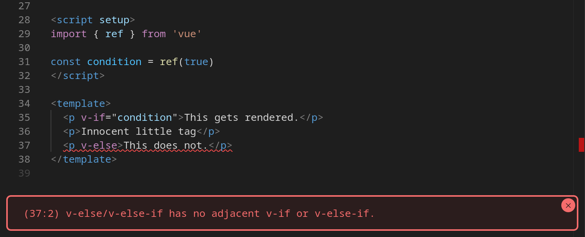

According to Wakapi, I've been working on projects written in SvelteKit for over 100 hours now.

<details>
  <summary>
    "Wait, I thought this was talking about Svelte, not SvelteKit."
  </summary>

[The Svelte team recommends using SvelteKit for new projects](https://svelte.dev/docs/introduction#start-a-new-project). Unlike React/Next and Vue/Nuxt, SvleteKit is maintained by the same team that maintains Svelte. They are essentially two halves of the framework.

SvelteKit isn't mandatory, but it's so incredible that I _highly_ recommend trying it before choosing an alternative.

</details>

## Table of Contents

# Getting Started With Svelte

[SvelteKit's documentation](https://kit.svelte.dev/docs/introduction) is excellent. By reading through the Getting Started and Core Concepts section of Sveltekit, I could get started with my project very quickly. I'd highly recommend you go through the [interactive tutorial](https://learn.svelte.dev/) to learn Svelte's syntax.

Running `pnpm create svelte@latest my-app` and selecting the skeleton project is enough to get started with. It sets you up with all the tools you'll need (build tool, linter, formatter, testing, etc.) to develop your app.

## Compared to Vue

I've worked with Vue 2/3 before, so transitioning to Svelte's syntax was very smooth. The reactivity syntax is much less verbose, and the template syntax feels much more natural.

```svelte
<ul>
  {#each i in iter}
    <li>{ i }</i>
  {/each}
</ul>
```

This feels like what I'm used to writing in templates. Vue's syntax abuses HTML tags.

```html
<ul>
  <li v-for="i in iter">{{ i }}</li>
</ul>
```

While the Vue.js syntax is more succinct, the loop is much more obvious in the svelte example. If statements make this explicity even more apparent and more appreciable.

```svelte
{#if condition}
  <p>This gets rendered.</p>
{:else}
  <p>This does not.</p>
{/if}
```

And in Vue.js.

```html
<p v-if="condition">This gets rendered.</p>
<p v-else>This does not.</p>
```

Again, the Vue.js example is shorter, but it's not obvious that a boolean is happening. Not only that, but what happens if want to add an innocent little tag after the `v-if`? [Well...](https://play.vuejs.org/#eNp9UbFOwzAQ/ZWTF0Aq6QBTlVYC1KEMgKCjlyi5pC7O2fJdSqUq/46dtKUD6mLZ9969e893UE/eZ7sO1UzlXAbjBRil8wtNpvUuCBwgYA091MG1cBOpN5o0lY5YIJ6VEeMI5ol1K6HDO035dJSKIvEh2HpbCKaX5B5296aea3Xu1Wqx3hiGBoWjClUYsMryafIAkPvFisiVSALWiFgEKZojfNRDyzhqVA4ZyMkRz6cXw9VECceptWmyLTuKkQ9pQrLSemMxvPvkh7WawYAkrLDW/bwOtZRucqqXGyy//6lveZ9qWn0EZAw71OqMSRFiyBFefr3hPt7PYOuqzkb2FfAT2dlu/LNEe+6oirYveIPb1bA4Q82al3tB4lOoZDQx+4GvVVzmy5Xof3YfssehT1Ov+l/RaL18)



We get a build error, which is better than a runtime error, but this now means we need to extract the v-if into a container component. Well we're at it, we might as well do the same thing for the `v-else` as well.

```html
<div v-if="condition">
  <p>This gets rendered.</p>
  <p>Innocent little tag.</p>
</div>

<div v-else>
  <p>This does not.</p>
</div>
```

This builds! Oh, wait, now it's longer than the svelte example... Huh. Not only that, but we now have a container element. Svelte renders the body of the conditionals inline. There is no `div` or other component containing them.

So, why can Svelte do this and Vue can't? One thing you might notice is that Vue adds their directives inside of the HTML tag while Svelte has its own syntax. Unlike Vue, Svelte isn't a library; it's a compiler. Vue's syntax must be a subset of HTML while Svelte can have any syntax that it wants.

Most of the rest of the syntax is similar between the two, with some minor deviations. The loop and conditional directives are the primary difference in template syntax.

### Reactivity

Here's a simple example.

```svelte
<script>
  let count = 0;

  function increment() {
    count += 1;
  }
</script>

<button on:click={increment}>
  Clicked {count}
  {count === 1 ? 'time' : 'times'}
</button>

```

And now Vue...

```html
<script setup>
  import { ref } from "vue";

  const count = ref(0);

  function increment() {
    count.value++;
  }
</script>

<template>
  <button @click="increment">
    Clicked {{ count }} {{ count === 1 ? "time" : "times" }}
  </button>
</template>
```

> Wait, what's ref???

A good question, dear viewer. `ref` is used to signal to Vue that the DOM needs to be updated when the value of that variable changes. Vue also has the `reactive` function which allows the variable to behave more like a normal object. If you're interested in the details, [here you go](https://vuejs.org/guide/essentials/reactivity-fundamentals.html).

Svelte isn't magic, though. For example, this won't work.

```svelte
<script>
  let count = 0;
  let doubled = 2 * count;

  function increment() {
    count += 1;
  }
</script>

<button on:click={increment}>
  Clicked {count}
  {count === 1 ? 'time' : 'times'}
</button>

<p>{ doubled }</p>
```

Svelte doesn't inherently know that `doubled` needs to be updated when `count` changes. To signal this, we use the `$` symbol.

```svelte
<script>
  let count = 0;
  $: doubled = 2 * count;

  function increment() {
    count += 1;
  }
</script>
...
```

Now it works! These are called reactive declarations. [You can even assign functions or do other fun stuff when the deceleration is updated!](https://geoffrich.net/posts/svelte-$-meanings/#heading-reactive-statements) How do you do this in Vue? Well...

```html
<script setup>
  import { ref, computed } from "vue";

  const count = ref(0);
  const doubled = computed(() => {
    return 2 * count.value;
  });

  function increment() {
    count.value++;
  }
</script>

<template>
  <button @click="increment">
    Clicked {{ count }} {{ count === 1 ? "time" : "times" }}
  </button>

  <p>{{ doubled }}</p>
</template>
```

> Computed...?

Yep, it's yet another wrapper. Computed values are basically cached functions that are re-evaluated when a reactive component inside of them changes. This achieves the same function as the `$` operator in Svelte.

Personally, I'm a much bigger fan of Svelte's syntax. The arcane symbol is definitely alien at first, but it's a quick identifier to tell you that something is different.

We'll move on for now, but if you enjoy Vue, then you might _really_ enjoy Svelte.

## Transitions

This is a fun one. Have you ever wanted to add a fade transition without going insane? Welp, here it is in Svelte!

```svelte
<script>
  import { fade } from 'svelte/transition';
  let show = false;
</script>

<button on:click={() => show = !show}>Toggle the Surprise</button>

{#if show}
  <h1 transition:fade>Surprise!</h1>
{/if}
```

> That's...it?

Yup, that's it. There are currently [7 transitions](https://svelte.dev/docs/svelte-transition) you can use out of the box. Their parameters are even customizable. No extra CSS necessary!

Enough about Svelte, let's move on to SvelteKit.

# Sveltekit

SvelteKit is a framework which handles the following:

1. Routing
2. Server-side Rendering
3. Data fetching
4. Form Actions
5. Server API endpoints

This is basically Svelte's version of Next or Nuxt. I'm glad they didn't go with Nest, Sext, or something else of that kin...

## Routing

SvelteKit uses file-based routing. Some people really dislike this. I'm a big fan of it myself.
